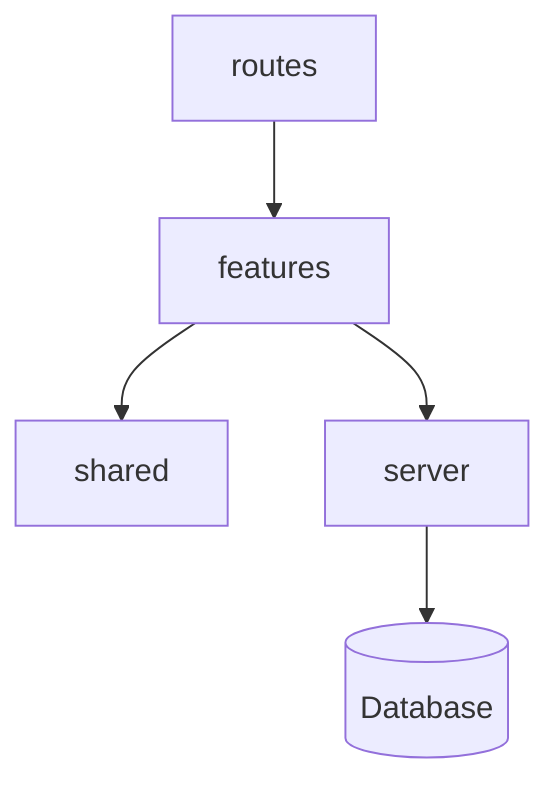

# Project documentation

Documentation helps humans **and** agents ship consistently. **Nothing here is mandatory** — audit what already exists, suggest gaps based on project shape, and respect when truth lives elsewhere (Figma, Notion, wiki, tickets).

## Principles

1. **`AGENTS.md` is the index, not the encyclopedia** — commands, non-negotiable rules, and links. Long guides live in `docs/` or external systems.
2. **One source of truth per topic** — cross-link; do not copy paragraphs between `AGENTS.md`, `README.md`, and guides.
3. **Progressive disclosure** — agents should open **one focused file** for the task, not load the whole tree.
4. **Mark status explicitly** — canonical vs planned vs exploratory vs non-normative (session plans).
5. **Living documentation** — docs drift when code changes. Update the relevant guide, diagram, or glossary **in the same PR** when structure, boundaries, data model, or product scope changes. Stale docs are worse than missing docs — flag drift during audits.
6. **External docs count** — if product or design lives in Notion/Figma, **link it** from `docs/README.md` or `AGENTS.md`; do not fork unless agents need offline access.

## Audit during standardization

Before creating files, inventory:

| Look for | Where |
|----------|--------|
| Agent index | `AGENTS.md` |
| Human readme | `README.md` |
| In-repo docs | `docs/`, `doc/`, `wiki/` |
| Domain glossary | `CONTEXT.md`, glossary section in product doc |
| Architecture | `docs/architecture.md`, ADRs, diagrams in wiki |
| Design | `docs/design/`, Figma/Framer links |
| Product | `docs/product.md`, Notion/Linear links |
| Module deep dives | `src/**/{MODULE,README}.md` co-located with code |
| API surface | OpenAPI, `API.md`, route index |
| Infra / decisions log | `setup-log.md`, `docs/adr/`, changelog |

Then determine **project shape** (ask once if unclear):

| Shape | Examples |
|-------|----------|
| Full-stack app | SvelteKit, Next.js with API routes, Nest + SPA |
| Frontend only | Vite SPA, Expo client without owned backend |
| Backend / API only | Nest service, Express API, workers |
| Monorepo | `apps/` + `packages/` — document per-app boundaries |
| Library / CLI | Minimal product doc; focus on API and contributing |

Present suggestions as a **menu** — user picks what to add now vs later. Do not scaffold empty `docs/` trees "just because."

## Suggested layers (all optional)

| Layer | Answers | Typical location | Suggest when |
|-------|---------|------------------|--------------|
| **Index** | "Read X when you need Y" | `docs/README.md` | Any non-trivial `docs/` folder |
| **Product** | What we build, MVP scope, UX intent, roadmap | `docs/product.md` or external link | Product-facing apps |
| **Architecture** | Layers, boundaries, monorepo map, diagrams | `docs/architecture.md` | Almost always for multi-folder apps |
| **Guides** | How one area works (auth, DB, i18n, feature X) | `docs/guides/{topic}.md` | Complex domains, onboarding |
| **Design** | Tokens, constraints, screen status, brand | `docs/design/` or Figma URL | Frontend with custom UI |
| **Patterns** | Cross-cutting code conventions | `docs/patterns/{name}.md` | Repeated structural patterns (providers, plugins) |
| **Plans** | Time-boxed session notes | `docs/plans/YYYY-MM-DD-{topic}.md` | Solo/agent-heavy workflows — **not normative** |
| **Glossary** | Project-specific terms | `CONTEXT.md` or section in `product.md` | Domain language agents must reuse |
| **ADRs** | Why a decision was made | `docs/adr/NNNN-title.md` | Teams needing decision traceability |
| **Co-located** | Implementation detail beside code | `src/**/FEATURE.md` | Large modules (link from index) |
| **Learnings** | Symptom → fix chronology | `AGENTS.md` section or `guides/setup-log.md` | After non-trivial debugging |

### Source-of-truth hierarchy (on conflict)

1. **Product** — what and why
2. **Architecture + guides + design** — structure and how
3. **Co-located module docs** — implementation detail (must not contradict architecture)
4. **Plans / session notes** — historical only; never override guides

## What `architecture.md` should cover

Adapt depth to project size. At minimum, answer:

- **Repo shape** — single app, monorepo, front-only, API-only?
- **Layer diagram** — Mermaid or ASCII: routes, features, shared, server, packages
- **Import boundaries** — what may import what (e.g. features cannot cross-import)
- **Data model** — ERD or entity list when persistence matters; mark **implemented** vs **planned**
- **Deploy / runtime** — where the app runs, env boundaries, external services (names only — no secrets)

Skip ERD for static sites or libraries with no persistence.

## Diagrams with Mermaid

Prefer **[Mermaid](https://mermaid.js.org/)** in markdown for diagrams agents and GitHub can render without external tools. Keep diagrams **in the doc they belong to** (usually `architecture.md` or a guide) — not orphaned image exports that go stale.

| Diagram type | Mermaid syntax | Use for |
|--------------|----------------|---------|
| Layers / system context | `flowchart TB` or `graph` | App boundaries, monorepo packages, import direction |
| Sequences / flows | `sequenceDiagram` | Auth flows, API request paths, agent tool loops |
| State machines | `stateDiagram-v2` | UI phases, workflow statuses |
| ERD / data model | `erDiagram` | Entities, relations — mark implemented vs planned in legend or comments |
| Timelines / roadmaps | `timeline` or `gantt` | Optional; product roadmaps when not in Notion |

Conventions:

- **Legend in prose** — e.g. solid lines = shipped, dashed = planned (Mermaid styling or a short note below the diagram)
- **Update with code** — when folders, modules, or entities change, update the diagram in the same change set
- **Small and focused** — one diagram per concern; split if the chart becomes unreadable
- **ASCII fallback** — only when Mermaid is unavailable; prefer Mermaid in GitHub/Cursor/VS Code previews

Example (layer boundaries):

````markdown

````

Tell the user during standardization: if `architecture.md` has no diagram yet, offer to add a starter Mermaid chart from the detected folder layout.

## External documentation

When truth lives outside the repo:

```markdown
## External sources

| Topic | Location | Notes |
|-------|----------|-------|
| Product spec | https://notion.so/... | Canonical for MVP scope |
| UI design | https://figma.com/... | Tokens mirrored in `docs/design/tokens.md` |
| API contract | https://... | OpenAPI is source of truth |
```

- Link from `docs/README.md` and the `AGENTS.md` fast-context table
- Mirror **only** what agents need offline (tokens, constraints) — not full Notion dumps
- Re-check links during standardization; flag stale URLs to the user

## `AGENTS.md` vs `docs/`

| Put in `AGENTS.md` | Put in `docs/` |
|--------------------|----------------|
| Stack, commands, package manager | Product narrative, architecture essays |
| Non-negotiable agent rules | Per-topic guides |
| Fast-context links (paths + URLs) | Mermaid diagrams, ERDs |
| Critical gotchas (one-liners) | Design specs, screen inventories |
| Optional team learnings (newest-first) | Dated plans, ADRs |

See [agents-md.md](agents-md.md) for the template.

## By project shape (suggestion menu)

| Shape | Start with | Add when needed |
|-------|------------|-----------------|
| **Solo product app** | `docs/README.md`, `architecture.md`, `product.md` (or link) | `guides/`, `design/`, `plans/`, co-located `*.md` |
| **Team product** | Above + glossary/CONTEXT, design index, ADRs | Contributing guide, PR template |
| **Frontend SPA** | Architecture + design link or `docs/design/` | Feature guides, component patterns |
| **Backend / API** | Architecture + `guides/database.md` + API index | ADRs, OpenAPI |
| **Monorepo** | Root `AGENTS.md` workspace table + per-app `docs/` or `AGENTS.md` | Package boundary diagram |
| **Library / CLI** | README + architecture (public API) | Skip product/design unless user-facing |

## Agent workflow

When the user asks to standardize documentation:

1. **Inventory** existing docs and external links — report what is already good.
2. **Identify gaps** relevant to the task (e.g. no architecture diagram for a 10-feature app).
3. **Propose** 2–4 concrete additions — user approves before writing.
4. **Write incrementally** — one file or section per change; link from index.
5. **Keep docs alive** — after structural or product changes, update architecture, ERD, and affected guides; mention doc updates in the standardization report.
6. **Update `AGENTS.md`** fast-context table with new paths — do not paste guide bodies.

## Anti-patterns

- Empty `docs/` scaffolding with placeholder files
- Duplicating guide paragraphs in `AGENTS.md` or root `README.md`
- Treating `docs/plans/` or session notes as canonical spec
- Requiring full product/design docs for internal tools or libraries
- Copying Figma/Notion wholesale into markdown without maintenance plan
- **One-time documentation dumps** that are never updated after the initial scaffold
- **Stale Mermaid diagrams** that no longer match the repo layout
- Loading entire `docs/` for every agent task — index should route to one file

## Related

- AGENTS.md template: [agents-md.md](agents-md.md)
- Security (no secrets in docs): [security.md](security.md)
- Optional extras (ADR folder, CONTEXT.md): [complementary-practices.md](complementary-practices.md)
